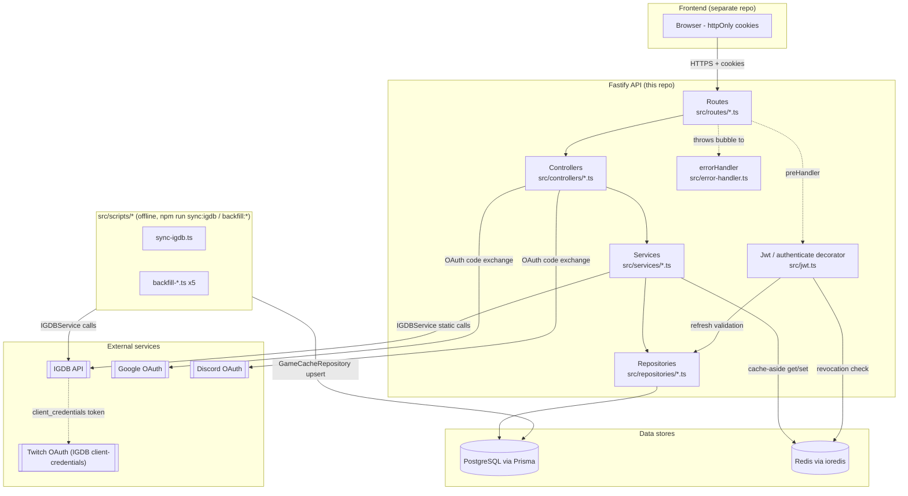

# Codebase Map

> Auto-generated by Cartographer. Last mapped: 2026-09-12T18:31:10Z

## System Overview

Fastify + Prisma + PostgreSQL + Redis backend for "Lib", a personal game-library tracker. Frontend is a separate React+Vite repo (`lib-front-end`), out of scope here. Layered: routes → controllers → services → repositories → Prisma/Postgres, with Redis as a cache-aside layer and IGDB as the external game-data provider (Twitch client-credentials OAuth). No DI container — each route file manually wires its own controller/service/repository graph.



## Directory Structure

```
src/
  controllers/     thin: parse Zod -> call service -> shape reply
  services/        business rules, cache-aside decisions, IGDB-shape formatting
  repositories/    sole Prisma/Redis access points per domain
  routes/          per-resource route registration (manual DI wiring)
  schemas/         Zod schemas (dual duty: runtime validation + route typing)
  types/           raw shapes (IGDB, DTOs, sort params)
  dtos/            plain input DTOs at repo/service boundary
  errors/          ClientError, IGDBRequestError
  database/        prisma + redis singletons
  scripts/         sync-igdb.ts + 5 idempotent backfill scripts
prisma/
  schema.prisma
  migrations/      20 migrations, see Schema Evolution below
  seed.ts          STALE — targets pre-IGDB-pivot schema, see Gotchas
docs/
  redis-caching.md historical design rationale (see Gotchas)
  CODEBASE_MAP.md  this file
```

## Prisma Schema

Generators: `prisma-client-js` + `prisma-dbml-generator` (auto-derives `prisma/dbml/schema.dbml` — don't hand-edit).

| Model | Table | Key fields | Relations | Notes |
|---|---|---|---|---|
| `User` | `users` | `email`(unique), `userName`, `password`, `profilePicture`, `userBanner`, `googleId`(unique, nullable), `discordId`(unique, nullable) | hasMany `UserGame`, `RefreshToken`, `Rating` | `password` NOT nullable even for OAuth users (tried nullable, reverted) — OAuth signup generates a random bcrypt hash the user never uses. |
| `RefreshToken` | `refresh_token` | `token`(unique), `expiresAt`, `isValid` | belongsTo `User`, cascade | One active row per user in practice — prior rows hard-deleted on new token issuance. |
| `Rating` | `ratings` | `value`(Float), unique `[userId, igdbId]`, indexed `igdbId` | belongsTo `User`, cascade | One rating per user per game, 0–5 in 0.5 steps. |
| `UserGame` | `user_games` | `igdbId`(Int, no FK — external IGDB id), unique `[userId, igdbId]` | belongsTo `User` (cascade), `UserGamesStatus`, hasOne `UserGameStats` | The library join table. Game metadata joined manually via raw SQL to `games_cache`, never a DB-level FK. |
| `UserGamesStatus` | `users_games_status` | `status`(enum `Status`) | hasMany `UserGame` | Static lookup, 5 seeded rows, exposed via `GET /status`. |
| `Status` (enum) | — | `PLAYED, PAUSED, PLAYING, BACKLOG, WISHLIST` | — | `PAUSED` added later; frontend has no UI to set it. |
| `GameCache` | `games_cache` | `igdbId`(pk), `name`, `coverUrl`, `genres[]`, `platforms[]`, `releaseDate`(epoch), `hypes`, `totalRatingCount`, `category`, `parentGameId`, `syncedAt` | none (standalone mirror) | **Not a TTL cache** — manually-synced denormalized IGDB mirror, indexed for listing/search/sort. |
| `UserGameStats` | `user_game_stats` | `completions`(Int, default 0), `hoursPlayed`(Decimal(6,2), nullable) | belongsTo `UserGame`, cascade, unique `userGameId` | 1:1 with `UserGame`. `hoursPlayed` blocked at service layer for WISHLIST status. |

### Schema evolution (migration history, chronological highlights)

1. `20250502232217_init` — old relational catalog (`Game`/`Platform`/`Category`/`GameStudio`/`Publisher`).
2–13. Incremental: `UserGame` alterations, `UserGameStats` added, DLC join table dropped for `isDlc` bool, `Rating` table added (int→float), Google OAuth, password-nullable tried+reverted, `UserGamesStatus` lookup introduced, `PAUSED` status added.
14. `20251230123626_add_discord_id` — Discord OAuth begins.
15. **`20260623113545_replace_games_with_igdb`** — pivot: drops the entire local relational catalog, switches `UserGame`/`Rating` to raw `igdbId: Int`. This is where `prisma/seed.ts` became stale.
16–20. `games_cache` introduced + progressively enriched (`hypes`, `totalRatingCount`, `category`/`parentGameId`, `Rating.igdbId` index for aggregation perf).

## Full Route Map

`preHandler: [app.authenticate]` is the `RequireAuth`-equivalent guard, applied per-route.

### `/auth` (auth.routes → AuthController → AuthService → AuthRepository + CacheRepository)
| Method | Path | Auth | Notes |
|---|---|---|---|
| POST | `/auth/register` | no | rate-limited 5/min |
| POST | `/auth/login` | no | rate-limited 3/min |
| POST | `/auth/refresh` | reads `refreshToken` cookie | rotates refresh token |
| POST | `/auth/logout` | reads both cookies | invalidates refresh token in DB + revokes access token in Redis |
| GET | `/auth/google`, `/auth/google/callback` | no | manual state-based OAuth, bypasses `@fastify/oauth2` helpers |
| GET | `/auth/discord`, `/auth/discord/callback` | no | same manual-state pattern |

### `/users` (UserController → UserService)
| Method | Path | Auth |
|---|---|---|
| GET | `/users/me` | yes |
| GET | `/users/:userId` | no |
| GET | `/users/` | yes |
| POST/DELETE | `/users/games/:igdbId` | yes |
| PATCH/GET | `/users/gameStatus/:igdbId` | yes |
| GET | `/users/userGames` | yes |
| PATCH/DELETE | `/users/` | yes |
| GET/PATCH | `/users/playedCount/:igdbId` | yes |
| GET/PATCH | `/users/hoursPlayed/:igdbId` | yes |
| GET | `/users/featuredGames` | yes |

### `/games` (GameController → GameService)
| Method | Path | Auth |
|---|---|---|
| GET | `/games/featured`, `/games/comingSoon`, `/games/similarGames/:igdbId`, `/games/`, `/games/:igdbId` | no |

### `/rating` (RatingController → RatingService)
| Method | Path | Auth |
|---|---|---|
| POST/GET/DELETE | `/rating/:igdbId` | yes |
| GET | `/rating/:igdbId/average`, `/rating/`, `/rating/game/:igdbId`, `/rating/ratingDistribution/:igdbId` | no |

### `/status` (UserGameStatusController → UserGameStatusService)
| Method | Path | Auth |
|---|---|---|
| GET | `/status/` | no |

## Auth Flow

- **Cookies**: `accessToken` (httpOnly, secure, sameSite lax, 15min), `refreshToken` (httpOnly, secure, sameSite lax, 7d). Global `@fastify/cookie` plugin defaults (`httpOnly: false`, `sameSite: none`) are dead config — every actual `setCookie` call overrides them.
- **`app.authenticate` decorator** (src/jwt.ts): verify access token → check Redis `revoked:${accessToken}` → on missing/invalid access token, silently refresh via `refreshToken` cookie (no rotation on silent renewal, only on explicit `/auth/refresh`) → retry verify → clear cookies + 401 on any failure.
- **Password auth**: bcrypt hash (cost 10), generic "Email or password wrong" on any mismatch (doesn't leak which field).
- **Google/Discord OAuth**: `@fastify/oauth2` registered but its helpers are bypassed — routes hand-roll state generation (stored in Redis, `oauth-state:${state}`, TTL 600s, single-use), manual authorize URL construction, and a manual `fetch` token-exchange fallback if the plugin's method fails. OAuth users get a throwaway random bcrypt password (schema requires non-null `password`). OAuth errors redirect browser to `${FRONTEND_URL}/auth?error=oauth_failed` (not JSON).

## IGDB Integration — Three-Tier Data Strategy

1. **Live IGDB API** (`IGDBService`, static-only class, no DI) — direct fetch, Twitch client-credentials OAuth, in-memory singleton token cache (process-local, 60s safety margin before expiry).
2. **`games_cache` Postgres table** — manually-synced mirror, NOT a TTL cache. Used only for listing/search/sort and joining metadata onto library rows. Populated by `npm run sync:igdb` (resumable, walks ascending id) + 5 backfill scripts (hypes, total_rating_count, category/parent_game, missing DLC/expansion content, user-library gaps).
3. **Redis cache-aside** (`CacheRepository`) — TTL 3600s, per-method key prefixes:

| Method | Source | Redis key |
|---|---|---|
| `findAllGames` (browse) | `games_cache` Postgres | none (already local) |
| `findGameById` | live IGDB | `game:${igdbId}` |
| `findSimilarGames` | live IGDB | `game:similar:${igdbId}` |
| `findComingSoonGames` | live IGDB | `games:comingSoon:${limit}:${pageIndex}` |
| `findTrendingGames`/`findMostRatedGames` (ranking) | Postgres, recomputed every request | **never cached** — freshness > latency for *which ids/order* |
| metadata for ranked ids | live IGDB (batched) | `game:meta:${id}` — distinct prefix, narrower field set than `game:${id}` |

**Opportunistic cache-fill** (writes only, request-time): `GameCacheService.ensureCached` before library-add/rating; `GameCacheService.cacheMany` fire-and-forget when `findManyGamesOfUser`'s join hits a missing `games_cache` row.

**`category` vs `game_type`**: `game.game_type ?? game.category ?? -1` — `game_type` preferred, `category` is legacy/often-unpopulated. `-1` sentinel (not `null`) so `category IS NULL` in `games_cache` can mean "backfill not yet run" without colliding with legitimately-absent values.

**`release_dates` dedup**: one row per platform+region pair; `formatGame` groups by platform, keeps earliest date. Only on single-game detail endpoint.

**Personal rating vs cross-user average**: always two separate concepts, never conflated. Personal: `RatingRepository.findUniqueByUserGame(igdbId, userId)`. Average: `aggregate`/`groupBy` on `Rating.value`, used to enrich list/detail `rating` fields even on authenticated endpoints.

## Redis Usage (actual state)

`docs/redis-caching.md` reads as a proposal but describes the **already-implemented** state: `REDIS_URL` singleton client, `CacheRepository` generic wrapper (game cache-aside, OAuth CSRF state, access-token revocation), rate limiting backed by Redis (global 100/min, `/auth/register` 5/min, `/auth/login` 3/min). Only gap: sorted-set ranking cache for trending/most-rated — deliberately deferred, not a prerequisite.

## Error Handling

Single global handler (`app.setErrorHandler`), no per-route try/catch:

| Error | HTTP | Body |
|---|---|---|
| `ClientError` (statusCode set per throw site) | as specified | `{ message }` |
| `IGDBRequestError` | 502 always | generic `{ message: 'Upstream game data provider failed' }` (raw IGDB error logged server-side only) |
| `ZodError` | 400 | `{ message: 'Invalid input', error: flattened field errors }` |
| anything else with `.statusCode` | that code | `{ message }` |
| unhandled | 500 | generic |

Exception: OAuth callback routes self-handle errors (redirect to frontend with `?error=` instead of JSON — browser-navigated flow, not an API call).

## Conventions

- Controllers: thin, parse Zod → call service → shape reply. No business logic.
- Services own business rules + cache-aside decisions. Repositories are the sole Prisma/Redis access point per domain — services never call `prisma`/`redis` directly.
- Raw `Prisma.sql` only where Prisma Client can't express the query (joins + aggregates for sort-by-rating listings, the user-library join); Prisma Client for everything else.
- Zod schemas serve dual duty: `.parse()` in controllers is the real validation gate; route `schema.response` blocks mainly drive typing/serialization, not validation.
- DTOs (`src/dtos/`) are separate from Zod schemas — DTOs at the repo/service boundary, schemas at the HTTP boundary.

## Gotchas

1. **`.env` committed to the repo** with live-looking secrets (JWT secret, Google/Discord OAuth secrets, IGDB client secret) — despite `.gitignore` excluding `.env`, one is present in the working tree. **Verify whether it's tracked by git and rotate any secret that is; do not copy these values elsewhere.**
2. **`prisma/seed.ts` is stale and broken** — targets the pre-`replace_games_with_igdb` schema (`prisma.game.upsert`, `Platform`, `Category`, etc., all since removed). Running `npx prisma db seed` today fails. Candidate for deletion or full rewrite.
3. **In-memory IGDB token cache** (`IGDBService` static fields) is process-local, not Redis — the one caching layer that didn't migrate when everything else moved to Redis (OAuth CSRF state did migrate).
4. **`tsconfig.json`'s `include`** references a root `fastify.d.ts` that doesn't exist (actual file: `src/types/fastify.d.ts`) — harmless since `src` is already included, but a stale/misleading entry.
5. **No `build`/`start` script** — dev-only via `tsx watch`; no compiled-`dist` pipeline defined despite `dist` being eslint-ignored.
6. **`test-igdb.mjs`** at repo root is an ad-hoc standalone script, not wired into npm scripts — manual IGDB OAuth sanity-check tool, not part of the app.
7. **Rating a game auto-adds it to the library as PLAYED** if not already owned (`RatingService.createRating`) — rating implies ownership+completion in this app's model; not obvious from the endpoint name alone.
8. **`UserGameStatusService.itemsPerPage`** field is dead/unused — no pagination logic references it.
9. **Manual OAuth flow bypasses `@fastify/oauth2`'s own helpers** for both Google and Discord (hand-rolled state/CSRF via Redis, manual authorize URL, manual fetch fallback for token exchange) — the plugin is registered but only partially used (`getNewAccessTokenUsingRefreshToken` is the one plugin method actually called, as a first attempt before the manual fallback).
10. **No DI container** — each route file (`auth.ts`, `game.ts`, `rating.ts`, `users.ts`, `userGameStatus.ts`) independently `new`s up its own controller/service/repository graph; shared repositories (`RatingRepository`, `GameCacheRepository`, `UserRepository`) are instantiated multiple times across files rather than singleton-shared.

## Navigation Guide

- **Add a new endpoint**: create/extend a route file under `src/routes/`, add a controller method (parse Zod → call service), add the service method (business logic + cache-aside if needed), add/extend the repository method (Prisma Client, or raw `Prisma.sql` only if a join/aggregate requires it).
- **Modify auth**: `src/jwt.ts` (token/cookie mechanics + `authenticate` decorator) → `src/services/auth.service.ts` (business logic) → `src/repositories/auth.repository.ts` (DB access) → `src/routes/auth.ts` (OAuth hand-rolled flows live here, not in the controller for the redirect endpoints).
- **Change IGDB data shape**: `src/services/igdb.service.ts` (`formatGame`/`toGameCacheInput` — raw IGDB → app shape) → `src/schemas/game.schema.ts` (outward Zod shape) → check `game_type`/`category`/`parentGameId` precedence comments before changing classification logic.
- **Add a new backfill/sync script**: mirror the pattern in `src/scripts/` — batch + sleep delay + resumable cursor + `$disconnect` at the end; register as an `npm run backfill:*` script in `package.json`.
- **Change the games_cache schema**: `prisma/schema.prisma` `GameCache` model → migration → `GameCacheRepository` → `IGDBService.toGameCacheInput` (sync-time mapping) → relevant backfill script if existing rows need filling.
